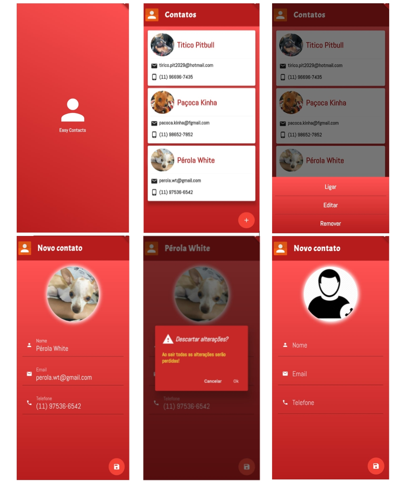

# Easy Contacts

Aplicativo para cadastro e gerenciamento simples e rápido de contatos

## Screenshots

### Features

 - Uso de banco de dados (sqlLite) para armazenamento dos contatos
 - Menu Popup com opções para ordenar os items
 - Opções de Ligar, Editar e remover com Menu Botom Sheet
 - Acesso à câmera e galeria para obtenção da photo
 - Formulário de edição e cadastro
 - Alerta de alterações ao sair da tela de edição
 - Recuso de restaurar contato deletado via Snackbar
 - Permite acionar o telefone para iniciar uma ligação de chamada
 - Validação de dados ao salvar
 - Foco automático nos campos de edição

### Dependências

- Google Fonts `google_fonts: ^1.1.0`
- Splashscreen `splashscreen: ^1.2.0`
- SQF Lite  `sqflite: any`
- URL Launcher `url_launcher: ^5.0.2`
- ImagePicker ` image_picker: ^0.6.0+3`
- Mask Formatter `mask_text_input_formatter: ^1.1.0`
- Email Validator `email_validator: ^1.0.0`

### Plugins e Widget utizados
- Snackbar
- PopupMenuButton
- Card
- AlertDialog
- FloatingAddButtonAction
- Form with GlobalKey
- TextFormField with FocusNode
- TextFormField with TextEditingController
- WillPopScope
- SingleChildScrollView

    
